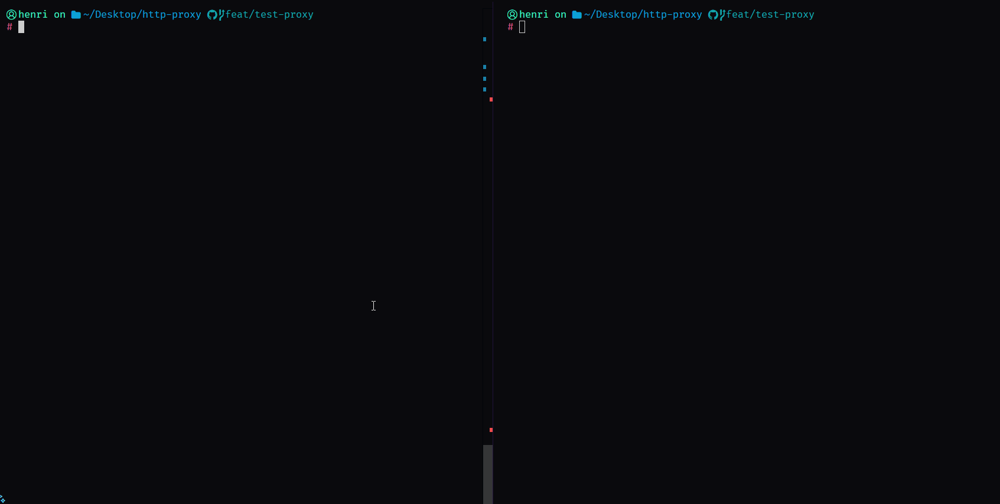

<h1 align="center"> 🧭 HTTP Proxy Server </h1>

<p align="center">
  
</p>

<p align="center">
   English
   | 
  <a href="./docs/pt-br/README.md">Português</a>
</p>

A robust and configurable HTTP proxy server developed in TypeScript, featuring authentication, host access control, and logging. Ideal for scenarios such as Discord bots, data scraping, and traffic control.

## 🚀 Features

- 🔐 Basic authentication via `.env`
- 🌐 Host access control
- 📄 Logging with Winston
- ⚙️ Configuration via environment variables
- 🧪 Modular and extensible structure

## 📦 Installation

1. Clone the repository:

   ```bash
   git clone https://github.com/HCDevWorks/http-proxy.git
   cd http-proxy
   ```

2. Install the dependencies:

   ```bash
   pnpm install
   ```

3. Configure the `.env` file:

   ```env
   PORT=8888
   ENABLE_LOGS=true
   ENABLE_ERROR_LOGS=false
   PROXY_USERNAME=your_username
   PROXY_PASSWORD=your_password
   ALLOWED_HOSTS='google.com','youtube.com'
   ```
## 🛠️ Usage

Start the proxy server with:

```bash
pnpm build # build the server

and

pnpm start # start the server
```

The server will listen on the port defined in `PORT` (default: 8888).

## 🛡️ Allowed Hosts

The proxy server restricts outgoing connections to a specific list of allowed hosts for security and control.  
You can configure which domains are permitted by editing the `allowedHosts` array in [`src/core/server.ts`](src/core/server.ts):

```typescript
const allowedHosts = [
  'discord.com',
  'youtube.com',
  'googlevideo.com',
];
```

Only requests targeting hosts that include one of these strings will be allowed through the proxy.  
To allow more domains, simply add them to the array.  
If a client tries to access a host not listed, the connection will be blocked and logged.

## 📁 Project Structure

```
http-proxy/
├── src/
│   ├── config/
│   │   └── config.ts       # Loads environment variables
│   ├── logger/
│   │   └── logger.ts       # Winston logger configuration
│   └── server/
│       └── server.ts       # Main proxy server logic
├── .env                    # Environment variables
├── package.json
├── pnpm-lock.yaml
├── tsconfig.json
└── docs/
    └── pt-br/
        └── README.md       # Documentation in Brazilian Portuguese
```

## 🤝 Contributing

Contributions are welcome! Feel free to open issues or pull requests.

## 📄 License

This project is licensed under the MIT License.